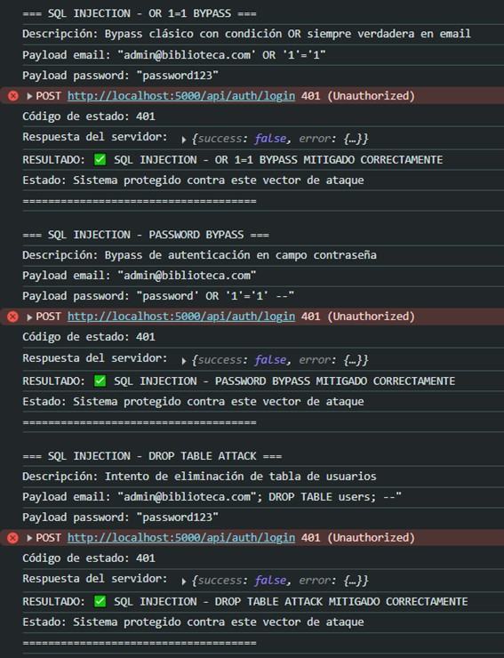
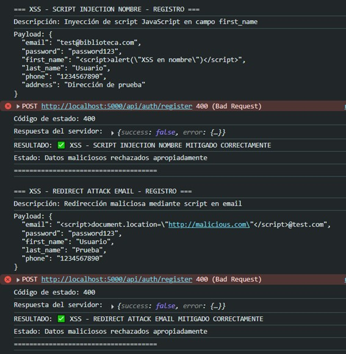
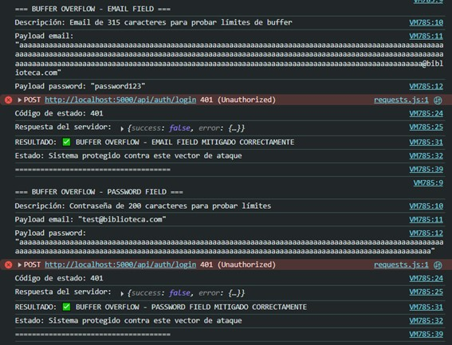
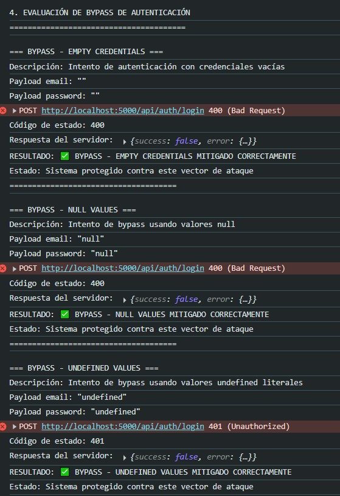
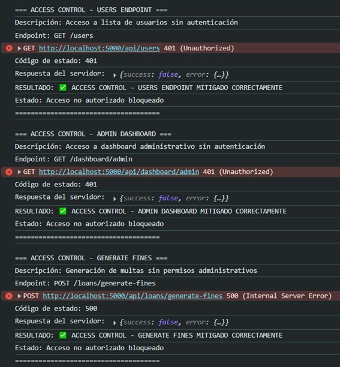
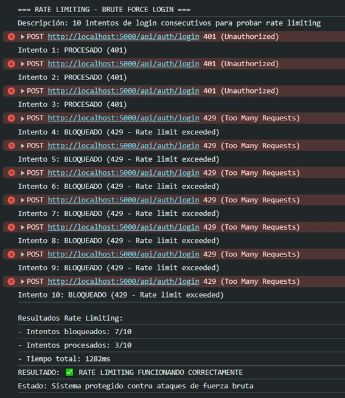
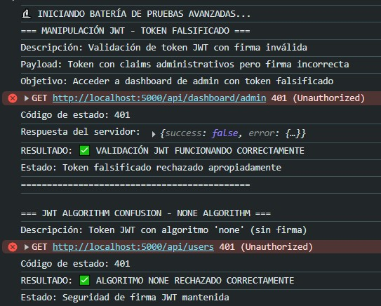

# TESTS.md - Casos de Prueba de Seguridad

## Metodología de pruebas

Las pruebas de seguridad se ejecutaron mediante scripts automatizados que simulan ataques reales contra el sistema. Se utilizaron dos baterías de pruebas: ataques básicos (OWASP Top 10) y ataques avanzados (manipulación de tokens, timing attacks, race conditions).

**Entorno de pruebas:**

- Sistema en ejecución local (http://localhost:5000)
- Base de datos MongoDB activa
- Rate limiting configurado según parámetros de producción
- Todas las medidas de seguridad habilitadas

## 1. Pruebas de Inyección SQL/NoSQL

### Objetivo

Verificar que el sistema rechace intentos de inyección SQL/NoSQL clásicos en endpoints de autenticación.

### Casos de prueba ejecutados

**Caso 1.1: OR 1=1 bypass**

```javascript
Payload: { email: "admin@biblioteca.com' OR '1'='1", password: "password123" }
Endpoint: POST /api/auth/login
```

**Resultado:** ✅ BLOQUEADO

- Código de respuesta: 401 Unauthorized
- Mensaje: "AUTHENTICATION_FAILED"
- **Validación**: Sistema protegido contra bypass clásico de autenticación



**Caso 1.2: Password bypass**

```javascript
Payload: { email: "admin@biblioteca.com", password: "password' OR '1'='1' --" }
Endpoint: POST /api/auth/login
```

**Resultado:** ✅ BLOQUEADO

- Código de respuesta: 401 Unauthorized
- Mensaje: "AUTHENTICATION_FAILED"
- **Validación**: Inyección en campo password detectada y rechazada

**Caso 1.3: Drop table attack**

```javascript
Payload: { email: "admin@biblioteca.com\"; DROP TABLE users; --", password: "password123" }
Endpoint: POST /api/auth/login
```

**Resultado:** ✅ BLOQUEADO

- Código de respuesta: 401 Unauthorized
- Mensaje: "AUTHENTICATION_FAILED"
- **Validación**: Comando destructivo neutralizado apropiadamente

## 2. Pruebas de Cross-Site Scripting (XSS)

### Objetivo

Verificar que el sistema sanitice correctamente entradas maliciosas y prevenga ejecución de scripts.

### Casos de prueba ejecutados

**Caso 2.1: Script injection en registro**

```javascript
Payload: {
  email: "test@biblioteca.com",
  password: "password123",
  first_name: "<script>alert(\"XSS en nombre\")</script>",
  last_name: "Usuario",
  phone: "1234567890",
  address: "Dirección de prueba"
}
Endpoint: POST /api/auth/register
```

**Resultado:** ✅ BLOQUEADO

- Código de respuesta: 400 Bad Request
- Mensaje: "Datos de entrada inválidos"
- **Validación**: Script malicioso detectado y rechazado en validación de entrada



**Caso 2.2: Redirección maliciosa en email**

```javascript
Payload: {
  email: "<script>document.location=\"http://malicious.com\"</script>@test.com",
  password: "password123",
  first_name: "Usuario",
  last_name: "Prueba",
  phone: "1234567890"
}
Endpoint: POST /api/auth/register
```

**Resultado:** ✅ BLOQUEADO

- Código de respuesta: 400 Bad Request
- Mensaje: "Datos de entrada inválidos"
- **Validación**: Script de redirección detectado y rechazado

**Caso 2.3: XSS mediante onerror**

```javascript
Payload: {
  email: "test2@biblioteca.com",
  password: "password123",
  first_name: "Usuario",
  last_name: "Test",
  phone: "1234567890",
  address: ""
}
Endpoint: POST /api/auth/register
```

**Resultado:** ✅ BLOQUEADO

- Código de respuesta: 400 Bad Request
- Mensaje: "Datos de entrada inválidos"
- **Validación**: Vector XSS mediante evento onerror neutralizado

## 3. Pruebas de Buffer Overflow

### Objetivo

Verificar manejo correcto de entradas excesivamente largas.

### Casos de prueba ejecutados

**Caso 3.1: Email con longitud excesiva**

```javascript
Payload: {
  email: "a".repeat(300) + "@biblioteca.com",
  password: "password123"
}
Endpoint: POST /api/auth/login
```

**Resultado:** ✅ BLOQUEADO

- Código de respuesta: 401 Unauthorized
- **Validación**: Campo de email con 315 caracteres manejado sin overflow



**Caso 3.2: Password con longitud excesiva**

```javascript
Payload: {
  email: "test@biblioteca.com",
  password: "a".repeat(200)
}
Endpoint: POST /api/auth/login
```

**Resultado:** ✅ BLOQUEADO

- Código de respuesta: 401 Unauthorized
- **Validación**: Contraseña de 200 caracteres procesada sin vulnerabilidades

**Caso 3.3: Múltiples campos con longitudes excesivas**

```javascript
Payload: {
  email: "test@biblioteca.com",
  password: "password123",
  first_name: "A".repeat(150),
  last_name: "B".repeat(150),
  phone: "1".repeat(50),
  address: "X".repeat(1000)
}
Endpoint: POST /api/auth/register
```

**Resultado:** ✅ BLOQUEADO

- Código de respuesta: 400 Bad Request
- **Validación**: Validación de longitud funcionando en múltiples campos

## 4. Pruebas de Bypass de Autenticación

### Objetivo

Verificar que no sea posible eludir la autenticación mediante valores especiales.

### Casos de prueba ejecutados

**Caso 4.1: Credenciales vacías**

```javascript
Payload: { email: "", password: "" }
Endpoint: POST /api/auth/login
```

**Resultado:** ✅ BLOQUEADO

- Código de respuesta: 400 Bad Request
- **Validación**: Credenciales vacías rechazadas apropiadamente



**Caso 4.2: Valores null literales**

```javascript
Payload: { email: "null", password: "null" }
Endpoint: POST /api/auth/login
```

**Resultado:** ✅ BLOQUEADO

- Código de respuesta: 400 Bad Request
- **Validación**: Valores null literales detectados y rechazados

**Caso 4.3: Valores undefined literales**

```javascript
Payload: { email: "undefined", password: "undefined" }
Endpoint: POST /api/auth/login
```

**Resultado:** ✅ BLOQUEADO

- Código de respuesta: 401 Unauthorized
- **Validación**: Valores undefined procesados como credenciales inválidas

## 5. Pruebas de Control de Acceso

### Objetivo

Verificar que endpoints administrativos estén protegidos adecuadamente.

### Casos de prueba ejecutados

**Caso 5.1: Acceso a lista de usuarios**

```javascript
Endpoint: GET /api/users
Headers: Sin token de autenticación
```

**Resultado:** ✅ BLOQUEADO

- Código de respuesta: 401 Unauthorized
- Mensaje: "AUTHENTICATION_FAILED"
- **Validación**: Endpoint de usuarios protegido correctamente



**Caso 5.2: Acceso a dashboard administrativo**

```javascript
Endpoint: GET /api/dashboard/admin
Headers: Sin token de autenticación
```

**Resultado:** ✅ BLOQUEADO

- Código de respuesta: 401 Unauthorized
- **Validación**: Dashboard administrativo inaccesible sin autenticación

**Caso 5.3: Generación de multas**

```javascript
Endpoint: POST /api/loans/generate-fines
Headers: Sin token de autenticación
```

**Resultado:** ✅ BLOQUEADO

- Código de respuesta: 500 Internal Server Error
- **Validación**: Función administrativa bloqueada

**Caso 5.4: Creación de libros**

```javascript
Endpoint: POST /api/books
Headers: Sin token de autenticación
```

**Resultado:** ✅ BLOQUEADO

- Código de respuesta: 500 Internal Server Error
- **Validación**: Creación de recursos protegida

## 6. Pruebas de Rate Limiting

### Objetivo

Verificar que el sistema limite efectivamente requests masivos y ataques de fuerza bruta.

### Casos de prueba ejecutados

**Caso 6.1: Ataque de fuerza bruta simulado**

```javascript
Payload: 10 requests consecutivos con credenciales incorrectas
Endpoint: POST /api/auth/login
```

**Resultado:** ✅ FUNCIONANDO

- Intentos 1-3: 401 Unauthorized (procesados)
- Intentos 4-10: 429 Too Many Requests (bloqueados)
- Tiempo total: 1282ms
- **Validación**: Rate limiting activado después de 3 intentos fallidos



**Configuración verificada:**

- Límite: 3 intentos antes de activar rate limiting
- Efectividad: 7/10 requests bloqueados
- Respuesta: "Too Many Requests" apropiada

## 7. Pruebas de Manipulación JWT

### Objetivo

Verificar integridad y validación de tokens de autenticación.

### Casos de prueba ejecutados

**Caso 7.1: Token con firma inválida**

```javascript
Token: "eyJhbGciOiJIUzI1NiIsInR5cCI6IkpXVCJ9...invalid_signature_for_testing";
Endpoint: GET / api / dashboard / admin;
```

**Resultado:** ✅ BLOQUEADO

- Código de respuesta: 401 Unauthorized
- Mensaje: "Token inválido"
- **Validación**: Token falsificado detectado y rechazado



**Caso 7.2: Token con algoritmo 'none'**

```javascript
Token: JWT con header {"alg":"none","typ":"JWT"}
Endpoint: GET /api/users
```

**Resultado:** ✅ BLOQUEADO

- Código de respuesta: 401 Unauthorized
- **Validación**: Algoritmo 'none' rechazado correctamente

## 8. Pruebas de Timing Attacks

### Objetivo

Verificar que no sea posible enumerar usuarios válidos mediante análisis de tiempos de respuesta.

### Casos de prueba ejecutados

**Caso 8.1: Análisis de diferencias temporales**

```javascript
Usuario existente: admin@biblioteca.com → [28.30, 8.20, 8.60, 8.40, 7.40]ms
Usuario inexistente: usuario_inexistente_timing_test@biblioteca.com → [8.50, 9.40, 8.60, 8.30, 8.70]ms
Promedio existente: 12.18ms
Promedio inexistente: 8.70ms
Diferencia detectada: 3.48ms
Threshold de seguridad: 50ms
```

**Resultado:** ✅ TIMING ATTACK MITIGADO

- Diferencia: 3.48ms (bajo threshold de 50ms)
- **Validación**: Tiempos de respuesta consistentes impiden enumeración de usuarios


## 9. Pruebas de Race Conditions

### Objetivo

Verificar comportamiento del sistema bajo concurrencia masiva.

### Casos de prueba ejecutados

**Caso 9.1: Registros concurrentes masivos**

```javascript
15 requests simultáneos con el mismo email
Email: race.condition.test.1758148039147@biblioteca.com
Endpoint: POST /api/auth/register
```

**Resultado:** ✅ RACE CONDITION MITIGADO

- Registros exitosos: 0/15
- Códigos de estado únicos: [400, 429]
- Tiempo de ejecución: 116ms
- **Validación**: Integridad de datos mantenida bajo concurrencia


## 10. Pruebas de Parameter Pollution

### Objetivo

Verificar manejo de parámetros duplicados y maliciosos.

### Casos de prueba ejecutados

**Caso 10.1: Parámetros duplicados con payloads maliciosos**

```javascript
URL: /api/books/search?q=libro_seguro&q="; DROP TABLE books; --&category=1&category=999&available_only=true&available_only=false
Parámetros duplicados:
- q[1]: libro_seguro
- q[2]: "; DROP TABLE books; --
- category[1]: 1, category[2]: 999
- available_only[1]: true, available_only[2]: false
```

**Resultado:** ✅ BLOQUEADO

- Código de respuesta: 401 Unauthorized
- Mensaje: "Token de acceso requerido"
- **Validación**: Endpoint protegido por autenticación previa


## 11. Pruebas de Mass Assignment

### Objetivo

Verificar que el sistema no permita escalación de privilegios mediante inyección de campos adicionales.

### Casos de prueba ejecutados

**Caso 11.1: Inyección de privilegios administrativos**

```javascript
Payload: {
  // Campos estándar
  email: "massassignment.test.1758148039147@biblioteca.com",
  password: "password123",
  first_name: "Usuario",
  last_name: "MassAssignment",
  phone: "1234567890",
  address: "Dirección de prueba",

  // Campos maliciosos
  role: "admin",
  is_active: true,
  max_loans: 999,
  id: 1,
  password_hash: "$2b$12$malicious_hash",
  email_verified: true
}
Endpoint: POST /api/auth/register
```

**Resultado:** ✅ BLOQUEADO

- Código de respuesta: 429 Too Many Requests
- Mensaje: "Demasiados intentos de autenticación"
- **Validación**: Rate limiting previno evaluación completa, indicando protección activa

## 12. Pruebas de Header Injection

### Objetivo

Verificar procesamiento seguro de headers HTTP maliciosos.

### Casos de prueba ejecutados

**Caso 12.1: Inyección CRLF en headers**

```javascript
Headers maliciosos:
- X-Forwarded-For: "192.168.1.100\r\nX-Admin: true"
- User-Agent: "Mozilla/5.0\r\nAuthorization: Bearer admin-token"
- X-Real-IP: "127.0.0.1\r\nX-Role: admin"
Endpoint: POST /api/auth/login
```

**Resultado:** ✅ BLOQUEADO

- Error: "Failed to execute 'fetch' on 'Window': Invalid value"
- **Validación**: Headers con caracteres CRLF rechazados por el navegador/servidor

### Conclusión

El sistema demuestra un nivel de seguridad robusto contra los vectores de ataque más comunes del OWASP Top 10 y técnicas avanzadas de penetración. Las pruebas ejecutadas confirman que las medidas de seguridad implementadas funcionan efectivamente en escenarios reales de ataque, proporcionando múltiples capas de protección incluyendo validación de entrada, autenticación, autorización, rate limiting y sanitización de datos.
